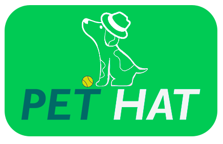

# PetHat Backend-Kotlin
---


### About the project:
PetHat is an application made in [Angular CLI](https://github.com/angular/angular-cli) and [SpringBoot](https://spring.io) whose main goal is to help veterinary clinics manage and schedule appointments.

### Requirements
[Node.js](https://nodejs.org/en) v16 or higher.
[Java 17](https://www.oracle.com/java/technologies/javase/jdk17-archive-downloads.html) or higher.
[Gradle 7](https://gradle.org/releases/) or higher
### Installation
#### Clone the project:
```
git clone https://github.com/GuilhermeJordao/PetHatBackend-Kotlin.git
```
### Install the backend dependencies:
```
./gradlew build
```
### Backend execution:
#### Start the backend:
```
./gradlew bootRun
```
### Accessing the application
The application will be available at http://localhost:8080.


